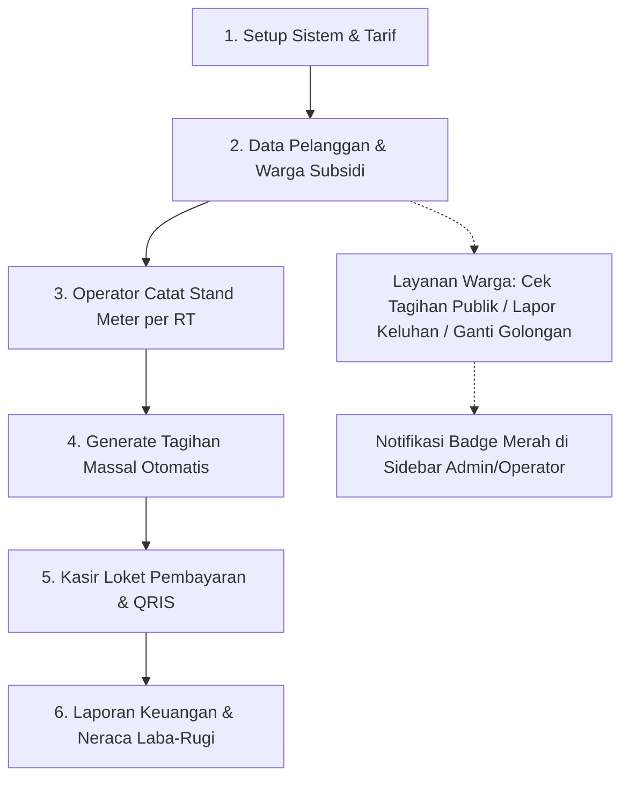

# 💧 Sandmosquito Water Billing

> **Sistem Informasi Pengelolaan, Pencatatan Meter, dan Pembayaran Rekening Air Bersih Desa Modern**  
> Ditenagai oleh **React 19 + TypeScript + Vite** untuk performa frontend ultra-cepat, dengan fleksibilitas **4 Pilihan Backend Database** (Supabase PostgreSQL Cloud, SQLite Lokal, Google Sheets GAS Cloud, dan LocalStorage Simulator).

---

## 📑 Daftar Isi
1. [🌟 Ringkasan Aplikasi & Arsitektur](#-ringkasan-aplikasi--arsitektur)
2. [🔄 Alur Lengkap Sistem dari Awal hingga Akhir](#-alur-lengkap-sistem-dari-awal-hingga-akhir)
   - [Langkah 1: Setup Awal & Konfigurasi Sistem](#langkah-1-setup-awal--konfigurasi-sistem)
   - [Langkah 2: Onboarding Pelanggan & Penetapan Warga Subsidi](#langkah-2-onboarding-pelanggan--penetapan-warga-subsidi)
   - [Langkah 3: Pencatatan Meter Lapangan Berbasis RT](#langkah-3-pencatatan-meter-lapangan-berbasis-rt)
   - [Langkah 4: Penerbitan & Generate Tagihan Massal](#langkah-4-penerbitan--generate-tagihan-massal)
   - [Langkah 5: Loket Kasir (POS), QRIS, & Cetak Struk](#langkah-5-loket-kasir-pos-qris--cetak-struk)
   - [Langkah 6: Portal Layanan Warga Mandiri & Cek Tagihan Publik](#langkah-6-portal-layanan-warga-mandiri--cek-tagihan-publik)
   - [Langkah 7: Layanan Pengaduan & Notifikasi Sidebar Real-Time](#langkah-7-layanan-pengaduan--notifikasi-sidebar-real-time)
   - [Langkah 8: Pencatatan Biaya Pemeliharaan & Operasional](#langkah-8-pencatatan-biaya-pemeliharaan--operasional)
   - [Langkah 9: Laporan Keuangan, Neraca Laba-Rugi, & Ekspor CSV](#langkah-9-laporan-keuangan-neraca-laba-rugi--ekspor-csv)
3. [🔐 Pengelolaan Kata Sandi Admin (Plain Text di Database)](#-pengelolaan-kata-sandi-admin-plain-text-di-database)
4. [👥 Hak Akses Role & Akun Demo Pengujian](#-hak-akses-role--akun-demo-pengujian)
5. [💾 4 Mode Database Backend yang Didukung](#-4-mode-database-backend-yang-didukung)
6. [📁 Skrip Migrasi 14 Tabel Database (`migrate/`)](#-skrip-migrasi-14-tabel-database-migrate)
7. [🚀 Panduan Memulai & Instalasi](#-panduan-memulai--instalasi)
8. [📄 Lisensi](#-lisensi)

---

## 🌟 Ringkasan Aplikasi & Arsitektur

**Sandmosquito Water Billing** adalah aplikasi web enterprise all-in-one yang dibangun untuk mendigitalisasi seluruh rantai operasional pengelolaan air bersih pedesaan, BUMDes (Badan Usaha Milik Desa), PAMSIMAS, maupun KPSPAMS di seluruh Indonesia.

```
+-----------------------------------------------------------------------------------+
|                        Sandmosquito Water Billing Frontend                        |
|                    (React 19 + TypeScript + Vite + WPO + PWA)                     |
+-----------------------------------------------------------------------------------+
                                         |
            +----------------------------+----------------------------+
            |                            |                            |
            v                            v                            v
 +----------------------+     +----------------------+     +----------------------+
 |  1. Supabase Cloud   |     |  2. SQLite Lokal     |     |  3. Google Sheets    |
 |  - PostgreSQL 17     |     |  - sandmosquito.db   |     |  - Google Apps Script|
 |  - RLS Policies      |     |  - WAL Mode Server   |     |  - Web App REST API  |
 |  - Backup Otomatis   |     |  - Port 3001         |     |  - Database Sheets   |
 +----------------------+     +----------------------+     +----------------------+
                                         |
                                         v
                              +----------------------+
                              |  4. LocalStorage     |
                              |  - Browser Simulator |
                              |  - 100% Offline Demo |
                              +----------------------+
```

---

## 🔄 Alur Lengkap Sistem dari Awal hingga Akhir

Aplikasi mengotomatiskan siklus tagihan air bulanan desa dari tahap konfigurasi, pencatatan, penagihan, hingga pelaporan keuangan:



### Langkah 1: Setup Awal & Konfigurasi Sistem
1. Administrator membuka menu **Pengaturan Sistem** (`/admin/settings`):
   - Mengisi Identitas BUMDes (Nama Aplikasi, Nama Desa, Alamat Kantor, WhatsApp, Email).
   - Menentukan **Aturan Pembayaran**: Tanggal jatuh tempo (misal tanggal 20), denda keterlambatan (Rp 5.000), dan biaya administrasi cetak faktur (Rp 2.500).
   - Mengonfigurasi **Rekening Bank** dan mengunggah **URL Barcode QRIS Resmi BUMDes**.
2. Mengatur **Tarif Bertingkat** (`/admin/tariffs`):
   - Menentukan tarif berjenjang (Tier 1: 0-10 m³, Tier 2: 11-20 m³, Tier 3: >20 m³) untuk kategori *Rumah Tangga*, *Niaga & UMKM*, serta *Sosial*.
3. Menetapkan akun petugas di **Kelola Operator** (`/admin/users`):
   - Memberikan penugasan wilayah RT khusus untuk setiap operator (contoh: Operator 1 ditugaskan di `RT 01 / RW 01`, Operator 2 di `RT 02 / RW 01`).

### Langkah 2: Onboarding Pelanggan & Penetapan Warga Subsidi
1. Pendaftaran sambungan pelanggan dapat dilakukan melalui:
   - **Input Langsung oleh Admin** (`/admin/customers`) beserta penetapan nomor meter SNI awal.
   - **Pendaftaran Mandiri Warga dengan Token** (`/register`): Admin membuat token di `/admin/tokens` (misal `DESA-AIR-2026`), warga memasukkan token untuk mendaftar akun sendiri.
2. **Fitur Warga Subsidi**:
   - Pada form pelanggan, admin dapat mengaktifkan opsi **Warga Subsidi**.
   - Pilihan subsidi:
     - **100% Gratis**: Pemakaian air berapapun gratis (tagihan otomatis Rp 0 dan berstatus Lunas), sangat cocok untuk Masjid/Musholla, Tempat Ibadah, atau Posyandu.
     - **Plafon Maksimal Bayar**: Menetapkan batas maksimal pembayaran (misal plafon Rp 20.000/bulan). Jika tagihan riil warga mencapai Rp 45.000, warga hanya membayar Rp 20.000 dan selisih Rp 25.000 otomatis tercatat sebagai subsidi BUMDes.

### Langkah 3: Pencatatan Meter Lapangan Berbasis RT
1. Pada awal bulan (tanggal 1–10), petugas operator lapangan membuka menu **Pencatatan Meter** (`/operator/readings`).
2. **Isolasi Wilayah RT**: Sistem secara otomatis memfilter daftar warga hanya untuk wilayah RT yang menjadi tanggung jawab operator tersebut.
3. Operator memasukkan angka stand meter akhir, foto bukti meteran (opsional), serta catatan lapangan.
4. **Deteksi Anomali Meter**: Sistem otomatis memvalidasi apakah angka meter lebih kecil dari bulan lalu (*negative reading*) atau melonjak drastis di atas batas wajar.

### Langkah 4: Penerbitan & Generate Tagihan Massal
1. Setelah pencatatan stand meter selesai, pengelola membuka menu **Generate Tagihan** (`/operator/bills` atau `/admin/bills`).
2. Cukup pilih periode bulan dan tahun, lalu klik tombol **Terbitkan Tagihan Massal**.
3. Sistem secara otomatis menghitung rincian biaya:
   $$\text{Total} = \text{Beban Tetap} + \text{Pemakaian Tiered} + \text{Biaya Admin} - \text{Potongan Subsidi}$$
4. Tagihan langsung berstatus `Belum Dibayar` dengan tanggal jatuh tempo sesuai konfigurasi BUMDes.

### Langkah 5: Loket Kasir (POS), QRIS, & Cetak Struk
1. Warga datang ke kantor desa / loket kasir (`/operator/payments` atau `/admin/payments`).
2. Kasir mencari nama warga atau nomor pelanggan, lalu memilih metode pembayaran:
   - **Tunai**: Dilengkapi kalkulator uang diterima & nominal kembalian otomatis.
   - **Transfer Bank**: Menampilkan nomor rekening bank tujuan resmi BUMDes.
   - **QRIS**: Menampilkan kode barcode QRIS resmi yang dapat langsung di-scan dari aplikasi mobile banking / e-wallet warga.
3. Setelah klik simpan, sistem mencetak **Struk Kuitansi Thermal 80mm** atau **Faktur Tagihan Resmi** siap cetak.

### Langkah 6: Portal Layanan Warga Mandiri & Cek Tagihan Publik
1. **Cek Tagihan Publik** (`/cek-tagihan`): Warga dapat mengecek tagihan dan riwayat pemakaian cukup dengan mengetikkan Nomor Pelanggan tanpa perlu login.
2. **Dashboard Warga** (`/customer/dashboard`): Warga yang login dapat melihat grafik riwayat konsumsi air per bulan, mengunduh kuitansi pembayaran, dan mengecek rincian subsidi yang diterima.
3. **Pemulihan Kata Sandi Mandiri** (`/forgot-password`): Warga yang lupa kata sandi dapat mereset sandi secara mandiri dengan memverifikasi 4 digit NIK dan nomor kontak terdaftar.

### Langkah 7: Layanan Pengaduan & Notifikasi Sidebar Real-Time
1. Warga dapat mengajukan tiket laporan kendala di **Lapor Keluhan** (`/customer/complaints`) seperti pipa bocor, air mati, atau meteran rusak.
2. Warga juga dapat mengajukan **Pindah Golongan Tarif** (`/customer/subscription-request`).
3. **Buletan Notifikasi Sidebar Real-Time**:
   - Sidebar Admin & Operator langsung memunculkan **badge merah berdenyut** jika ada keluhan baru masuk yang berstatus `Menunggu`.
   - Sidebar memunculkan **badge kuning** jika ada pengajuan perubahan golongan yang menunggu persetujuan.
   - Angka notifikasi berkurang otomatis seketika admin/operator menanggapi laporan tanpa perlu refresh halaman browser.

### Langkah 8: Pencatatan Biaya Pemeliharaan & Operasional
1. Pengelola mencatat seluruh pengeluaran operasional air desa di menu **Biaya Pemeliharaan** (`/admin/maintenance`).
2. Kategori pengeluaran mencakup: *Perbaikan Pipa PVC & Kebocoran*, *Token Listrik PLN Pompa Sumur Bor*, *Kaporit / Obat Klorin Penjernih*, *Suku Cadang Meteran*, serta *Honor Petugas Lapangan*.

### Langkah 9: Laporan Keuangan, Neraca Laba-Rugi, & Ekspor CSV
1. Pengelola membuka menu **Laporan & Analitik** (`/admin/reports`):
   - **Rekap Pendapatan**: Total penerimaan kas loket per bulan.
   - **Rekap Tunggakan**: Daftar warga yang belum membayar per RT/RW.
   - **Laba-Rugi Bersih**: Kalkulasi otomatis $\text{Pendapatan Air} - \text{Biaya Pemeliharaan}$.
   - **Efisiensi Distribusi Air**: Perbandingan total kubikasi air yang dipompa vs air yang tertagih ke warga.
2. Seluruh laporan dapat diekspor ke format **CSV / Excel** atau dicetak langsung.

---

## 🔐 Pengelolaan Kata Sandi Admin (Plain Text di Database)

Untuk kemudahan pengelola BUMDes di lapangan, kata sandi akun **disimpan dalam bentuk teks biasa (plain text)** pada kolom `password_hash` tabel `users`.

> [!TIP]
> **Jika Anda lupa kata sandi Administrator:**
> 1. Buka database Anda (Table Editor Supabase, SQLite DB Browser, atau tab Google Sheets).
> 2. Buka tabel `users`, cari baris dengan `username = 'admin'`.
> 3. Langsung ubah nilai pada kolom `password_hash` menjadi kata sandi baru (misal: `kuncidesa2026`).
> 4. Anda dapat langsung login kembali menggunakan kata sandi tersebut tanpa perlu enkripsi/hashing.

---

## 👥 Hak Akses Role & Akun Demo Pengujian

| Role | Username | Kata Sandi | Wilayah / Deskripsi Akses |
|---|---|---|---|
| **Administrator Utama** | `admin` | `admin123` | Akses penuh: master tarif, pelanggan, meter, tagihan, token, biaya pemeliharaan, keluhan, audit log, dan pengaturan. |
| **Petugas Operator RT 01** | `operator` | `operator123` | Akses operasional lapangan & kasir untuk pelanggan di wilayah **RT 01 / RW 01**. |
| **Petugas Operator RT 02** | `operator2` | `operator123` | Akses operasional lapangan & kasir untuk pelanggan di wilayah **RT 02 / RW 01**. |
| **Warga Reguler** | `CUST-2026-0001` | `warga123` | Bpk. Budi Santoso (RT 01) - Tarif Rumah Tangga Reguler. |
| **Warga Subsidi Plafon** | `CUST-2026-0002` | `warga123` | Ibu Siti Aminah (RT 01) - Penerima Subsidi Plafon Maks. Rp 20.000/bln. |
| **Fasilitas Ibadah Gratis** | `CUST-2026-0005` | `warga123` | Masjid Jami Al-Ikhlas (RT 01 / RW 02) - Subsidi 100% Gratis. |

---

## 💾 4 Mode Database Backend yang Didukung

Pilih salah satu backend database pada file `.env` melalui variabel `VITE_ACTIVE_BACKEND`:

```env
# Pilihan: supabase | sqlite | gas | mock
VITE_ACTIVE_BACKEND=supabase

# 1. Supabase Cloud (Default Rekomendasi)
VITE_SUPABASE_URL=https://<your-project-ref>.supabase.co
VITE_SUPABASE_ANON_KEY=<your-anon-key>

# 2. SQLite Backend Server Lokal
VITE_SQLITE_API_URL=http://localhost:3001

# 3. Google Apps Script Cloud
VITE_GAS_API_URL=https://script.google.com/macros/s/.../exec
```

---

## 📁 Skrip Migrasi 14 Tabel Database (`migrate/`)

Folder `migrate/` menyediakan skrip skema relasional 14 tabel lengkap untuk semua jenis backend:

| No | Nama Tabel | Fungsi & Kolom Utama |
|---|---|---|
| 1 | `users` | Pengguna sistem (`username`, `password_hash`, `role`, `assigned_rt`, `is_active`). |
| 2 | `tariffs` | Tarif berjenjang (`base_fee`, `tier1_max`, `tier1_rate`, `tier2_max`, `tier2_rate`, `tier3_rate`). |
| 3 | `customers` | Data sambungan warga & subsidi (`is_subsidized`, `subsidy_type`, `subsidy_max_amount`, `subsidy_notes`). |
| 4 | `meters` | Informasi fisik meteran air SNI (`meter_no`, `brand`, `initial_reading`, `current_reading`). |
| 5 | `meter_readings` | Riwayat input stand meter bulanan (`prev_reading`, `current_reading`, `usage_m3`, `photo_url`). |
| 6 | `bills` | Faktur tagihan bulanan (`base_amount`, `usage_amount`, `admin_fee`, `subsidy_amount`, `total_amount`). |
| 7 | `payments` | Transaksi pembayaran loket kasir (`amount_paid`, `payment_method`, `cashier_id`). |
| 8 | `settings` | Pengaturan profil BUMDes, jatuh tempo, info bank, dan URL barcode QRIS. |
| 9 | `audit_logs` | Catatan jejak audit aktivitas sistem. |
| 10 | `announcements` | Siaran pengumuman & broadcast info warga/petugas. |
| 11 | `complaints` | Layanan tiket keluhan warga & tindak lanjut operasional. |
| 12 | `subscription_requests` | Formulir pengajuan permohonan ganti golongan tarif pelanggan. |
| 13 | `registration_tokens` | Token pendaftaran onboarding mandiri warga baru. |
| 14 | `maintenance_expenses` | Catatan pengeluaran pemeliharaan & operasional BUMDes. |

---

## 🚀 Panduan Memulai & Instalasi

### 1. Prasyarat
- [Node.js](https://nodejs.org/) v18+ atau [Bun](https://bun.sh/) runtime.

### 2. Instalasi Dependensi
```bash
git clone https://github.com/andrizre/water-billing.git
cd water-billing
npm install
```

### 3. Menjalankan Server Frontend Development
```bash
npm run dev
```
Buka browser di `http://localhost:5173`.

### 4. Menjalankan Server SQLite Backend (Khusus Mode SQLite)
```bash
npm run server
```
Server berjalan di `http://localhost:3001` dan otomatis mengelola file database `sandmosquito.db`.

### 5. Melakukan Build Production
```bash
npm run build
```
Hasil build siap saji tersimpan di folder `dist/` dengan optimasi code-splitting, tree-shaking, dan aset terkompresi.

---

## 📄 Lisensi

Hak Cipta © 2026 **BUMDes Tirta Sandmosquito**.  
Aplikasi ini bersifat *open-source* dan bebas digunakan serta dikembangkan untuk kemajuan digitalisasi tata kelola air bersih pedesaan di seluruh Indonesia.
